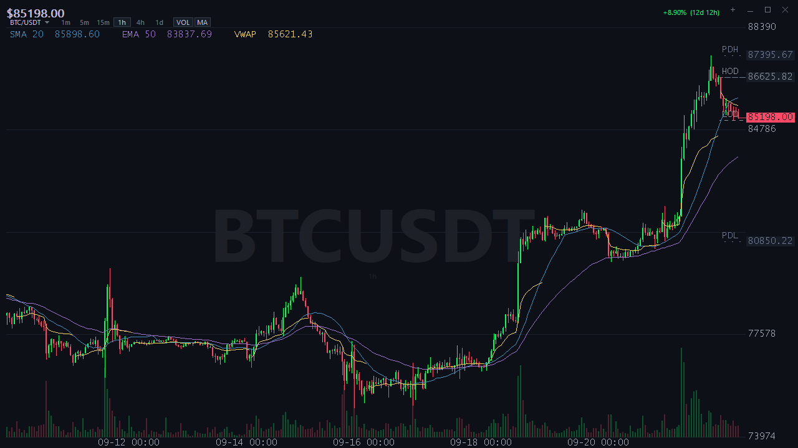
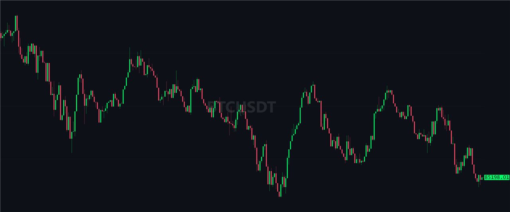

# TickC

A crypto price ticker for the Windows tray, written in plain C against the Win32 API.
Two source files. No runtime, no installer, no dependencies beyond what ships with Windows.
The whole thing compiles to a single exe of about 240 KB.

I built it because I wanted the BTC price in the corner of my screen without keeping
a browser tab open, and without a 150 MB Electron app. It grew from there.



## What it does

- **Tray icon** with the live price. Updates every 3 seconds. With no connection to
Binance it shows `...` and says so in the tooltip, and keeps retrying.
- **A header on the Bloomberg model:** a quote line with Last, Chg, %Chg, Op, Hi, Lo, Vol
and At for the UTC trading day, a range field (1D … Max, and the bar size), and a gear
that opens the chart settings: volume, averages, RSI and the theme.
- **Chart panel** (left-click the icon): candlesticks, SMA 20, EMA 50 and a daily VWAP,
with the volume in a pane of its own under the price and an optional RSI 14 pane. You
also get today's high and low, and yesterday's high, low and close (labelled HOD, LOD,
PDH, PDL, PDC).
- **Symbols:** BTC, ETH, SOL and BNB against USDT.
- **Intervals:** 1m, 5m, 15m, 1h, 4h, 1d, 1w, from a dropdown in the toolbar.
- **Ranges:** 1D, 3D, 1M, 6M, YTD, 1Y, 5Y, Max. A range picks a fitting interval and shows
exactly that period, and the change in the header is over the range. You can switch the
interval afterwards and keep the range. Zoom or pan away, and `R` brings you back.
YTD starts on 1 January and grows by a day each day.
- **Price alerts.** Click the price column to set one. When the price gets there you get a
balloon and a sound, even with the panel closed.
- **Desktop mode.** The chart sits on your wallpaper, behind the desktop icons.
It stays quiet on purpose: no volume or moving averages there unless you turn them on.
- **Dark or light.** A light theme from the tray menu (or `T`), with every text on it
readable at WCAG AA contrast. The panel and desktop mode each have their own choice.
- **Scrolls back in time.** Pan into the left edge and it fetches older candles,
up to 6000 of them.



## Getting it

Download `TickC.exe` from the [Releases](../../releases) page, put it anywhere, and run it.
No installer. Or build it yourself, below.

## Requirements

- Windows 8 or newer (developed on Windows 11)
- To build: MSVC, either Visual Studio or the free
[Build Tools for Visual Studio](https://visualstudio.microsoft.com/downloads/#build-tools-for-visual-studio-2022),
with the Windows SDK

## Building

Open a **Developer Command Prompt for VS** in the repo folder and run:

```
cl /nologo /W4 /O2 tickc.c chart.c /link /SUBSYSTEM:WINDOWS /MANIFEST:EMBED /MANIFESTINPUT:tickc.manifest /OUT:TickC.exe
```

That's it. The libraries are pulled in with `#pragma comment(lib, ...)` in the source,
so there's no build script to keep in sync. Don't skip the manifest: without it
Windows refuses the layered child window, and desktop mode shows up blank.

### Tests

The chart engine (`chart.c`) has golden tests that draw it into a memory DC, with
no window and no network, from seeded synthetic candles:

```
cl /nologo /W4 /O2 /I. /Fo:tests\ /Fe:tests\chart_golden.exe tests\chart_golden.c chart.c user32.lib gdi32.lib
tests\chart_golden.exe
```

Before the pictures, the run checks every text/background pair of the light theme
against WCAG AA (4.5:1). Each case is hashed and compared with `tests/golden/chart.txt`; a failing case
is written to `tests/out/` as a BMP. Text goes through the installed fonts and
the ClearType setting, so the hashes hold for the machine that wrote them. On
another machine, look at the pictures (`--bmp`) and rewrite them with `--update`.

## Usage

Run `TickC.exe`. An icon appears in the tray and the chart panel opens. Only one
copy runs at a time: starting it again brings up the panel of the one that's running.


| Action                     | What happens                                                            |
| -------------------------- | ----------------------------------------------------------------------- |
| Left-click the tray icon   | Show or hide the chart panel                                            |
| Right-click the tray icon  | Show panel, symbol, interval, range, overlays, theme, desktop mode, autostart, quit |
| `TickC.exe --desktop-mode` | Start with the chart on the desktop                                     |
| `TickC.exe --autostart`    | Start quietly, with only the tray icon (what "Start at sign-in" uses)   |

`--desktop-mode` only counts when TickC isn't already running. In desktop mode, starting
it again shows a balloon that points to the tray menu.

In the tray menu, the bold "Show panel" brings the panel up (it never hides it), and most
items show the panel key that does the same. Under Range, "None" turns the range off.


In the chart panel:


| Key                             | Action                                                            |
| ------------------------------- | ----------------------------------------------------------------- |
| Mouse wheel, `+` / `-`          | Zoom                                                              |
| Drag, `←` / `→`                 | Pan                                                               |
| `PgUp` / `PgDn`                 | Jump one screen                                                   |
| `Home` / `End`                  | Oldest / newest candle                                            |
| `S` / `B` / `G`                 | Open the symbol, interval (bar size) or settings menu             |
| `1` … `7`                       | Switch interval                                                   |
| `Shift`+`1` … `8`               | Switch range (1D … Max); the selected one again turns it off      |
| `V`                             | Volume pane on/off                                                |
| `M`                             | Indicators on/off (moving averages, VWAP, levels)                 |
| `I`                             | RSI band on/off (RSI 14 under the chart)                          |
| `T`                             | Light theme on/off                                                |
| `A`                             | Set an alert at the crosshair price                               |
| `R`, double-click               | Reset zoom and pan (to the range, if one is selected)             |
| `Esc`                           | Close an open menu, then reset the view, then hide the panel      |
| `Ctrl`+`0`                      | Reset window size and position                                    |
| `Ctrl`+`N`                      | Open another panel                                                |
| `Ctrl`+`M` / `F11` / `Ctrl`+`W` | Minimize / maximize / close                                       |

In an open menu (from `S`, `B`, `G`, a click on its cell in the header, or a right-click in the chart):


| Key                             | Action                                                            |
| ------------------------------- | ----------------------------------------------------------------- |
| `↑` / `↓`, `Home` / `End`       | Move the highlighted row                                          |
| `Enter`, `Space`                | Pick it (a setting toggles, and the menu stays open)              |
| `←` / `→`                       | Previous / next menu (symbol, interval, settings); in the right-click picker, the other column |
| `1` … `7`                       | Pick an interval (interval list and right-click picker)           |
| `V` / `M` / `I` / `T`           | Toggle a setting (settings menu)                                  |
| The menu's own letter, `Esc`    | Close it                                                          |


## What it writes to your system

Nothing outside your user profile. No admin rights needed.

- Settings live in `HKCU\Software\TickC`.
- "Start at sign-in" adds a `TickC` value under
`HKCU\Software\Microsoft\Windows\CurrentVersion\Run`, which starts it with `--autostart`.

To remove it completely, untick autostart in the tray menu, quit, and delete
`HKCU\Software\TickC`.

Earlier builds were called Ticker and used `HKCU\Software\Ticker`. The first time
TickC starts, it moves those settings, your price alerts and the autostart entry over
to the new name, then removes the old ones.

## How it's put together

`tickc.c` is the app: tray icon, window, worker thread, registry, alerts. `chart.c`
is the chart engine behind `chart.h`: geometry, view, indicators, sessions and all
the drawing, with no window, lock or network in it, so it can be reused elsewhere.
A worker thread fetches data over HTTPS with WinHTTP.
The UI thread draws with GDI into a back buffer that's kept between frames.
Nothing from the network is trusted: prices that come back as NaN, infinity, zero
or garbage are dropped before they reach the chart.

`WORKLOG.md` is the development diary. It covers why things are the way they
are, what was measured, and the pitfalls I ran into. The `(phase N)` notes in the
code comments point to its sections.

## Data source

Market data comes from the public [Binance API](https://developers.binance.com/docs/binance-spot-api-docs)
(`api.binance.com`). No account or API key is involved. It goes through the proxy
set in Windows, if there is one (a proxy that asks for a password isn't supported).
This project has no connection to Binance, and Binance doesn't endorse it.

Prices are for information only. Don't trade on a tray icon.

## License

MIT. See [LICENSE](LICENSE).